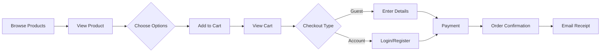
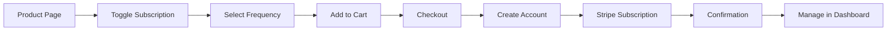

Excellent! Now I have a clear picture. Let me create a focused PRD for your Honduran specialty coffee business. This will be a premium, niche offering focusing on rare mountain-grown beans from Honduras with a compelling family story.

## 📋 **PRD: Honduras Mountain Coffee - Premium E-Commerce Platform**

### **1. Executive Summary**

A specialty coffee e-commerce platform featuring rare, high-altitude beans from family farms in the mountains of Honduras. The platform will offer both one-time purchases and subscription services, targeting coffee enthusiasts and casual drinkers across the EU. Built with Next.js, Supabase, Stripe, and a sophisticated shadcn/ui design using the claymorphism theme.

### **2. Brand Positioning**

**Unique Value Proposition:**
- **Exclusive Source:** Direct family connection to Honduran mountain farms
- **Rare Origins:** High-altitude beans from specific microclimates
- **Heritage Story:** Family-sourced, generational coffee farming
- **Limited Batches:** Small-lot, seasonal offerings
- **Transparency:** Complete traceability from farm to cup

### **3. Product Structure**

```
Product Catalog
├── Single Origin Collections
│   ├── Estate Reserve (Premium single farm)
│   ├── Mountain Select (High altitude 1500m+)
│   └── Seasonal Harvest (Limited editions)
│
├── Product Options
│   ├── Format: Whole Bean / Ground
│   ├── Grind Types (if ground):
│   │   ├── Espresso (Fine)
│   │   ├── Filter/Pour Over (Medium)
│   │   ├── French Press (Coarse)
│   │   └── Moka Pot (Medium-Fine)
│   └── Sizes: 250g / 500g / 1kg
│
└── Subscription Tiers
    ├── Explorer (Different coffee each delivery)
    ├── Purist (Same coffee preference)
    └── Curator's Choice (Premium selections)
```

### **4. Core Features (MVP)**

#### **4.1 Customer-Facing Features**

**Homepage**
- Hero section with Honduras story
- Featured coffee of the month
- Subscription benefits highlight
- Customer testimonials
- Farm/origin story teaser

**Product Pages**
- Origin details (farm, altitude, processing)
- Tasting notes visualization
- Brewing recommendations
- Roast profile indicator
- Stock availability
- Related products

**Shopping Features**
- Quick add to cart
- Subscription vs one-time toggle
- Guest checkout
- Saved cart (localStorage + database)
- EU shipping calculator
- VAT handling by country

**Account Dashboard**
- Order history
- Subscription management
- Address book
- Reorder shortcuts
- Download invoices (PDF)

#### **4.2 Admin Panel Features**

**Product Management**
- Add/edit products with variants
- Batch upload via CSV
- Image management
- Stock tracking
- Price management (including VAT)
- Archive/unarchive products

**Order Management**
- Order list with filters
- Order status updates
- Shipping label generation
- Refund processing
- Export orders to CSV
- Bulk status updates

**Inventory Control**
- Stock levels by variant
- Low stock alerts
- Stock adjustment logs
- Pre-order management

**Customer Management**
- Customer list and search
- Order history per customer
- Subscription management
- Email customer directly

**Analytics Dashboard**
- Revenue metrics
- Best-selling products
- Subscription metrics
- Customer geography
- Inventory turnover

### **5. Technical Implementation**

#### **5.1 Tech Stack**

```typescript
// Frontend Stack
- Next.js 14+ (App Router)
- TypeScript (strict mode)
- Tailwind CSS
- shadcn/ui with claymorphism theme
- React Hook Form + Zod
- TanStack Query v5
- Zustand (cart state)

// Backend Stack
- Supabase (PostgreSQL)
- Supabase Auth
- Supabase Storage (images)
- Edge Functions (complex operations)
- Row Level Security

// Payments & Tools
- Stripe Payment Elements
- Stripe Subscriptions
- Resend (transactional emails)
- Vercel Analytics
- Context7 for documentation
```

#### **5.2 Database Schema**

```sql
-- Products & Inventory
CREATE TABLE products (
  id UUID PRIMARY KEY DEFAULT gen_random_uuid(),
  name VARCHAR(255) NOT NULL,
  slug VARCHAR(255) UNIQUE NOT NULL,
  description TEXT,
  origin_farm VARCHAR(255),
  altitude INTEGER,
  processing_method VARCHAR(100),
  tasting_notes JSONB,
  roast_level VARCHAR(50),
  harvest_date DATE,
  story TEXT,
  featured BOOLEAN DEFAULT false,
  created_at TIMESTAMPTZ DEFAULT NOW(),
  updated_at TIMESTAMPTZ DEFAULT NOW()
);

CREATE TABLE product_variants (
  id UUID PRIMARY KEY DEFAULT gen_random_uuid(),
  product_id UUID REFERENCES products(id) ON DELETE CASCADE,
  sku VARCHAR(100) UNIQUE NOT NULL,
  format VARCHAR(20) CHECK (format IN ('whole_bean', 'ground')),
  grind_type VARCHAR(50),
  weight INTEGER, -- in grams
  price DECIMAL(10,2) NOT NULL,
  stock_quantity INTEGER DEFAULT 0,
  allow_backorder BOOLEAN DEFAULT false,
  created_at TIMESTAMPTZ DEFAULT NOW()
);

-- Orders & Subscriptions
CREATE TABLE orders (
  id UUID PRIMARY KEY DEFAULT gen_random_uuid(),
  order_number VARCHAR(20) UNIQUE NOT NULL,
  user_id UUID REFERENCES auth.users(id),
  email VARCHAR(255) NOT NULL,
  status VARCHAR(50) DEFAULT 'pending',
  subtotal DECIMAL(10,2),
  shipping_cost DECIMAL(10,2),
  tax_amount DECIMAL(10,2),
  total DECIMAL(10,2),
  currency VARCHAR(3) DEFAULT 'EUR',
  stripe_payment_intent_id VARCHAR(255),
  shipping_address JSONB,
  billing_address JSONB,
  notes TEXT,
  created_at TIMESTAMPTZ DEFAULT NOW(),
  shipped_at TIMESTAMPTZ,
  delivered_at TIMESTAMPTZ
);

CREATE TABLE subscriptions (
  id UUID PRIMARY KEY DEFAULT gen_random_uuid(),
  user_id UUID REFERENCES auth.users(id),
  stripe_subscription_id VARCHAR(255) UNIQUE,
  status VARCHAR(50),
  frequency VARCHAR(20), -- weekly, biweekly, monthly
  next_delivery DATE,
  product_variant_id UUID REFERENCES product_variants(id),
  quantity INTEGER DEFAULT 1,
  shipping_address JSONB,
  created_at TIMESTAMPTZ DEFAULT NOW(),
  paused_at TIMESTAMPTZ,
  cancelled_at TIMESTAMPTZ
);

-- Admin & Analytics
CREATE TABLE inventory_adjustments (
  id UUID PRIMARY KEY DEFAULT gen_random_uuid(),
  product_variant_id UUID REFERENCES product_variants(id),
  adjustment_type VARCHAR(50), -- restock, sale, damage, return
  quantity_change INTEGER,
  notes TEXT,
  adjusted_by UUID REFERENCES auth.users(id),
  created_at TIMESTAMPTZ DEFAULT NOW()
);
```

#### **5.3 Project Structure**

```
honduras-coffee/
├── app/
│   ├── (shop)/
│   │   ├── page.tsx                 # Homepage
│   │   ├── products/
│   │   │   ├── page.tsx             # Product listing
│   │   │   └── [slug]/page.tsx      # Product detail
│   │   ├── cart/
│   │   │   └── page.tsx             # Cart page
│   │   ├── checkout/
│   │   │   └── page.tsx             # Checkout flow
│   │   └── account/
│   │       ├── page.tsx             # Account dashboard
│   │       ├── orders/page.tsx      # Order history
│   │       └── subscription/page.tsx # Subscription management
│   │
│   ├── admin/
│   │   ├── layout.tsx               # Admin layout with auth
│   │   ├── page.tsx                 # Admin dashboard
│   │   ├── products/                # Product management
│   │   ├── orders/                  # Order management
│   │   ├── inventory/               # Stock management
│   │   └── customers/               # Customer management
│   │
│   ├── api/
│   │   ├── stripe/
│   │   │   ├── checkout/route.ts
│   │   │   ├── webhooks/route.ts
│   │   │   └── subscription/route.ts
│   │   └── admin/
│   │       └── [...routes]/route.ts
│   │
│   └── layout.tsx                   # Root layout
│
├── components/
│   ├── ui/                          # shadcn/ui components
│   ├── shop/
│   │   ├── ProductCard.tsx
│   │   ├── CartDrawer.tsx
│   │   ├── CheckoutForm.tsx
│   │   └── SubscriptionToggle.tsx
│   └── admin/
│       ├── DataTable.tsx
│       ├── StatsCard.tsx
│       └── OrderStatusBadge.tsx
│
├── lib/
│   ├── supabase/
│   │   ├── client.ts
│   │   ├── server.ts
│   │   └── admin.ts
│   ├── stripe/
│   │   ├── client.ts
│   │   └── server.ts
│   └── utils/
│       ├── formatters.ts
│       └── validators.ts
│
├── hooks/
│   ├── useCart.ts
│   ├── useAuth.ts
│   └── useSubscription.ts
│
└── types/
    ├── database.ts
    ├── stripe.ts
    └── shop.ts
```

### **6. User Flows**

#### **6.1 Purchase Flow**


#### **6.2 Subscription Flow**


### **7. Design System (Claymorphism Theme)**

The claymorphism theme will provide:
- Soft, organic shapes with subtle shadows
- Muted, earthy color palette (perfect for coffee)
- Smooth transitions and micro-animations
- Card-based layouts with depth
- Premium, artisanal feel

Key UI Components:
- Product cards with hover effects
- Smooth drawer animations for cart
- Toast notifications for actions
- Loading skeletons for better UX
- Responsive data tables for admin

### **8. Development Roadmap**

**Week 1-2: Foundation**
- Initialize Next.js with TypeScript
- Setup Supabase project and schema
- Configure shadcn/ui with claymorphism
- Basic routing structure
- Authentication setup

**Week 3-4: Product Catalog**
- Product listing page
- Product detail pages
- Search and filtering
- Cart functionality (Zustand)
- Responsive design

**Week 5-6: Checkout & Payments**
- Stripe integration
- Checkout flow
- Guest checkout
- Order confirmation
- Email notifications (Resend)

**Week 7-8: Subscriptions**
- Subscription product options
- Stripe subscription setup
- Customer portal integration
- Subscription management UI

**Week 9-10: Admin Panel**
- Admin authentication/authorization
- Product management CRUD
- Order management interface
- Inventory tracking
- Basic analytics dashboard

**Week 11-12: Polish & Launch**
- Performance optimization
- SEO implementation
- Testing (Playwright)
- EU compliance (GDPR, cookies)
- Deployment to Vercel

### **9. Environment Variables**

```env
# Supabase
NEXT_PUBLIC_SUPABASE_URL=
NEXT_PUBLIC_SUPABASE_ANON_KEY=
SUPABASE_SERVICE_ROLE_KEY=

# Stripe
NEXT_PUBLIC_STRIPE_PUBLISHABLE_KEY=
STRIPE_SECRET_KEY=
STRIPE_WEBHOOK_SECRET=
STRIPE_SUBSCRIPTION_PRICE_ID=

# Email (Resend)
RESEND_API_KEY=
RESEND_FROM_EMAIL=

# App
NEXT_PUBLIC_APP_URL=
ADMIN_EMAIL=
```

### **10. Success Metrics**

**Launch Goals (Month 1)**
- 50+ orders
- 10+ active subscriptions
- <2% cart abandonment
- 95%+ successful payments
- Zero critical bugs

**Growth Goals (Month 6)**
- 500+ monthly orders
- 100+ active subscriptions
- 15% subscription rate
- €50+ average order value
- 4.5+ customer rating
